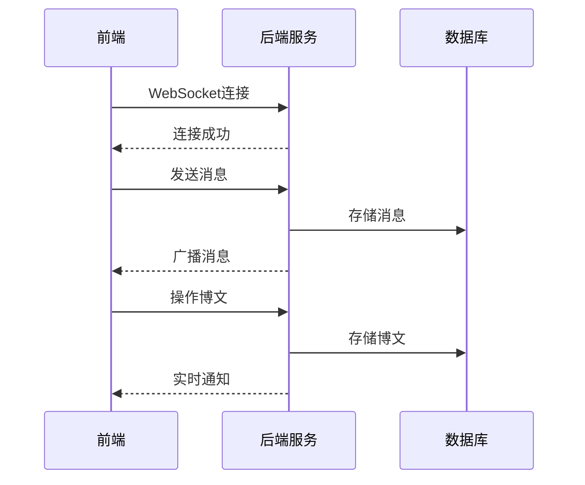

# TMS 项目 Code Wiki

## 1. 项目概述

TMS(Teamwork Management System)是基于频道模式的团队沟通协作+轻量级任务看板，支持markdown、富文本、在线表格和思维导图的团队博文wiki，i18n国际化翻译管理的响应式web开源团队协作系统。

### 主要功能

- 团队协作沟通功能(类似于slack、bearychat)
- 团队博文(wiki) 类似精简版confluence、蚂蚁笔记
- 国际化翻译管理

## 2. 目录结构

```
├── .github/            # GitHub配置文件
├── .trae/              # Trae配置文件
├── db/                 # 数据库配置文件
│   ├── mysql/          # MySQL配置
│   └── postgres/       # PostgreSQL配置
├── docs/               # 文档目录
│   └── img/            # 图片资源
├── k8s/                # Kubernetes配置
├── src/                # 源代码目录
│   ├── main/           # 主要代码
│   │   ├── java/       # Java代码
│   │   └── resources/  # 资源文件
│   └── test/           # 测试代码
├── .gitignore          # Git忽略文件
├── Dockerfile          # Docker构建文件
├── LICENSE             # 许可证文件
├── README.md           # 项目说明文件
├── deploy-pg.sh        # PostgreSQL部署脚本
├── deploy.sh           # 部署脚本
├── deploy2local.sh     # 本地部署脚本
├── docker-compose-pg.yml # PostgreSQL Docker配置
├── docker-compose.yml  # Docker配置
└── pom.xml             # Maven配置文件
```

## 3. 系统架构

TMS采用典型的Spring Boot Web应用架构，主要包括以下层次：

1. **表现层**：基于Thymeleaf模板引擎和静态资源
2. **业务逻辑层**：Spring Boot服务
3. **数据访问层**：Spring Data JPA
4. **数据存储**：MySQL/PostgreSQL

### 核心流程图



## 4. 核心功能模块

### 4.1 团队沟通模块

基于WebSocket实时通讯，支持频道沟通、私聊、markdown语法、@消息、文件上传等功能。

### 4.2 团队博文(wiki)模块

支持Markdown、Html富文本、电子表格、思维导图等多种类型博文创作，提供博文空间、目录、标签、版本历史等功能。

### 4.3 国际化翻译管理模块

包括翻译项目管理、语言管理、翻译导入导出等功能。

## 5. 主要实体类

### 5.1 安全相关实体

- **User**：用户实体
- **Authority**：权限实体
- **Group**：用户组实体
- **GroupAuthority**：用户组权限关联
- **GroupMember**：用户组成员关联

### 5.2 沟通相关实体

- **Channel**：频道实体
- **ChannelGroup**：频道组实体
- **Chat**：聊天消息实体
- **ChatAt**：@消息实体
- **ChatChannel**：频道聊天关联
- **ChatDirect**：私聊实体
- **ChatLabel**：聊天标签实体
- **ChatPin**：固定消息实体
- **ChatReply**：消息回复实体
- **ChatStow**：收藏消息实体

### 5.3 博文相关实体

- **Blog**：博文实体
- **BlogAuthority**：博文权限实体
- **BlogFollower**：博文关注实体
- **BlogHistory**：博文历史实体
- **BlogNews**：博文动态实体
- **BlogStow**：博文收藏实体

### 5.4 其他实体

- **Dir**：目录实体
- **File**：文件实体
- **Gantt**：甘特图实体
- **Label**：标签实体
- **Link**：链接实体
- **Log**：日志实体
- **Project**：项目实体
- **Schedule**：日程安排实体
- **Setting**：系统设置实体
- **Space**：空间实体
- **SpaceAuthority**：空间权限实体
- **Tag**：标签实体
- **Todo**：待办事项实体
- **Translate**：翻译项目实体
- **TranslateItem**：翻译项实体
- **TranslateItemHistory**：翻译项历史实体

## 6. 主要工具类

### 6.1 认证工具
- **AuthUtil**：认证相关工具方法

### 6.2 日期工具
- **DateUtil**：日期处理工具方法

### 6.3 文件工具
- **FileUtil**：文件处理工具方法

### 6.4 网络工具
- **WebUtil**：网络相关工具方法

### 6.5 数据处理工具
- **JsonUtil**：JSON处理工具方法
- **MapUtil**：Map处理工具方法
- **SqlUtil**：SQL处理工具方法

### 6.6 编码工具
- **SHA1**：SHA1编码工具方法
- **EncoderUtil**：编码器工具方法

### 6.7 其他工具
- **EnumUtil**：枚举处理工具方法
- **HtmlUtil**：HTML处理工具方法
- **PropUtil**：属性处理工具方法

## 7. 技术栈

### 7.1 后端技术
- **Java 8**：主要开发语言
- **Spring Boot 1.5.14**：应用框架
- **Spring Security**：安全框架
- **Spring Data JPA**：数据访问框架
- **WebSocket**：实时通讯
- **Thymeleaf**：模板引擎

### 7.2 前端技术
- **HTML5/CSS3/JavaScript**：前端基础
- **Bootstrap**：前端框架
- **Vue.js**：前端框架
- **Markdown**：文本编辑

### 7.3 数据库
- **MySQL**：主数据库
- **PostgreSQL**：可选数据库

### 7.4 部署技术
- **Docker**：容器化部署
- **Kubernetes**：容器编排

## 8. 依赖关系

### 8.1 核心依赖

| 依赖 | 版本 | 用途 |
|------|------|------|
| spring-boot-starter-websocket | 1.5.14 | WebSocket支持 |
| spring-boot-starter-data-jpa | 1.5.14 | JPA支持 |
| spring-boot-starter-web | 1.5.14 | Web支持 |
| spring-boot-starter-security | 1.5.14 | 安全支持 |
| spring-boot-starter-thymeleaf | 1.5.14 | 模板引擎 |
| mysql-connector-java | runtime | MySQL驱动 |
| postgresql | runtime | PostgreSQL驱动 |
| fastjson | 1.2.83 | JSON处理 |
| markedj | 1.0.9 | Markdown解析 |
| poi-ooxml | 3.17 | Excel处理 |
| jsoup | 1.15.3 | HTML解析 |
| mammoth | 1.4.0 | Word文档处理 |

## 9. 配置与部署

### 9.1 配置文件

- **application.properties**：主配置文件
- **application-dev.properties**：开发环境配置
- **application-prod.properties**：生产环境配置
- **application-tms.properties**：TMS特定配置

### 9.2 部署方式

1. **传统部署**：通过Maven构建War包，部署到Tomcat等容器
2. **Docker部署**：使用docker-compose.yml构建容器
3. **Kubernetes部署**：使用k8s目录下的配置文件部署

## 10. 运行方式

### 10.1 开发环境运行

1. 克隆代码仓库
2. 配置数据库（MySQL或PostgreSQL）
3. 修改application.properties中的数据库配置
4. 运行Application.java主类

### 10.2 生产环境运行

1. 使用Maven构建War包：`mvn clean package`
2. 部署到Tomcat等容器
3. 或使用Docker部署：`docker-compose up -d`

### 10.3 访问地址

默认访问地址：http://localhost:80/tms

## 11. 核心API

### 11.1 认证API
- **/tms/login**：登录接口
- **/tms/logout**：登出接口

### 11.2 沟通API
- **/tms/api/chat**：聊天相关接口
- **/tms/api/channel**：频道相关接口

### 11.3 博文API
- **/tms/api/blog**：博文相关接口
- **/tms/api/space**：空间相关接口

### 11.4 国际化API
- **/tms/api/translate**：翻译相关接口

## 12. 系统安全

### 12.1 认证机制
- 基于Spring Security的认证体系
- 支持OAuth2认证

### 12.2 权限控制
- 基于角色的权限控制
- 细粒度的资源权限管理

## 13. 监控与日志

### 13.1 日志配置
- 使用logback.xml配置日志
- 日志文件存储在log/tms目录

### 13.2 系统监控
- 使用Spring Boot Actuator进行系统监控
- 监控端点：/tms/manage

## 14. 总结

TMS是一款功能丰富的团队协作系统，提供了团队沟通、博文管理和国际化翻译管理等核心功能。系统采用Spring Boot框架开发，支持多种部署方式，适合中小型团队使用。通过本Code Wiki文档，开发者可以快速了解系统架构和核心功能，为二次开发和定制化提供参考。