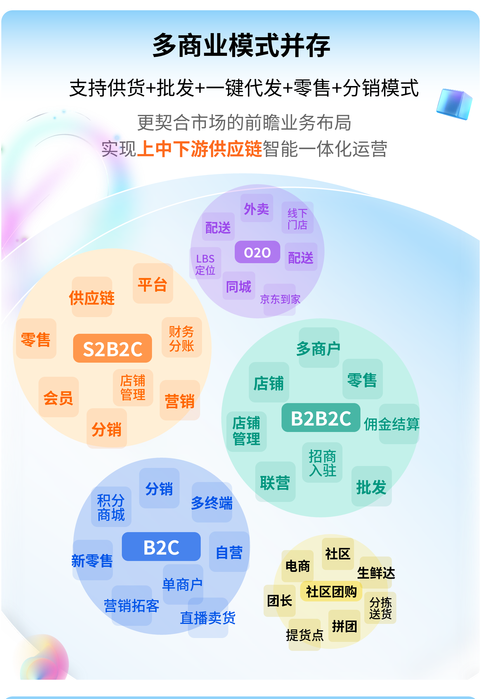
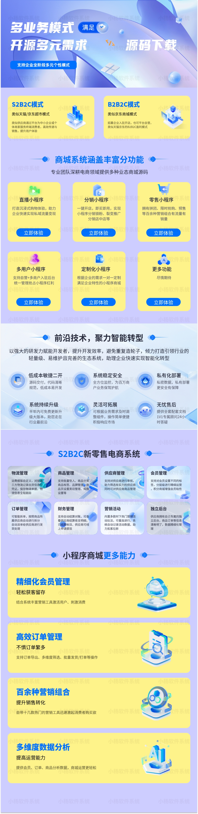

# 开源可商用商城系统

我们有多商家、社区团购、供应链商城系统一款轻量级、高性能、前后端分离的电商系统，支持微信小程序 + H5+ 公众号 + APP，前后端源码完全开源，看见及所得，完美支持二次开发，可学习可商用，让您快速搭建个性化独立商城。开源商城系统是一款全开源可商用的系统，前后端分离开发，全部100%开源，在小程序、公众号、H5、APP、PC端都能用，使用方便，二开方便！安装使用也很简单！使用文档、接口文档、数据字典、二开文档、视频教程，各种资料应有尽有，就算你是技术小白，也能轻松上手！
欢迎大家来体验、来提建议，来一起让开源商城系统更强大，让更多开发者受益！虽然是开源，但我们该有的功能全都有！拼团、秒杀、优惠券、抽奖、积分、直播、分销、页面DIY... 常用商城系统功能，都是全开源，直接用！

社区团购小程序系统，是以微信小程序为载体整合多个社区社群资源为社区居民提供“线上团购 + 线下自提”的商业模式，商家招募团长自带裂变属性，助商家解决社区团购经营中的困扰，快速打开商品销路。

基于市场的反馈和变化，我们在不断开发完善社区团购的基础上，增加属于我们自己的物流配送模块，来帮助线下门店针商品系统下单，批量出单，合理分配，精准配送，在投放在各大门店使用后，针对实际情况中出现的各种问题，我们不断的改进，收获了大家的好评和喜欢。
我们由衷希望社区团购系统可以通过 Gitee 平台让更多的人了解到好的产品。同时欢迎大家积极交流沟通，如有不足之处多给我们的项目提意见或建议，实现共同进步。

---

# TMS
> TMS(Teamwork Management System)是一款基于频道模式的团队沟通协作系统，集成轻量级任务看板、支持Markdown/富文本/在线表格/思维导图/画图/白板的团队博文wiki，以及i18n国际化翻译管理功能的响应式Web开源平台。

## 代码仓库
- **主仓库**
  - Gitee：https://gitee.com/xiweicheng/tms  
  - GitHub：https://github.com/xiweicheng/tms  

- **前端代码仓库**（已压缩打包到主仓库）
  - 沟通博文前端：https://gitee.com/xiweicheng/tms-frontend
  - 着陆首页前端：https://gitee.com/xiweicheng/tms-landing

## 文档与指南

### 操作手册
- [TMS用户手册（使用指导）](https://gitee.com/xiweicheng/tms/wikis/%E7%9D%80%E9%99%86%E9%A1%B5?sort_id=3692705)

### 部署指南
- [如何在开发工具中运行](https://gitee.com/xiweicheng/tms/wikis/%E5%A6%82%E4%BD%95%E5%9C%A8%E5%BC%80%E5%8F%91%E5%B7%A5%E5%85%B7%E4%B8%AD%E8%BF%90%E8%A1%8C?sort_id=351959)
- [TMS安装部署（传统方式）](https://gitee.com/xiweicheng/tms/wikis/TMS%E5%AE%89%E8%A3%85%E9%83%A8%E7%BD%B2%EF%BC%88%E4%BC%A0%E7%BB%9F%E6%96%B9%E5%BC%8F%EF%BC%89?sort_id=21982)
- [TMS安装部署（Docker Compose）](https://gitee.com/xiweicheng/tms/wikis/TMS%E5%AE%89%E8%A3%85%E9%83%A8%E7%BD%B2%EF%BC%88docker-compose%EF%BC%89?sort_id=21977)
- [TMS安装部署（Kubernetes方式）](https://gitee.com/xiweicheng/tms/wikis/TMS%E5%AE%89%E8%A3%85%E9%83%A8%E7%BD%B2%EF%BC%88k8s%E6%96%B9%E5%BC%8F%EF%BC%89?sort_id=3201498)

## 功能特性

### 核心功能
- **团队协作沟通**：类似Slack、BearyChat的实时沟通平台
- **团队博文(Wiki)**：类似精简版Confluence、蚂蚁笔记的知识管理系统
- **国际化翻译管理**：专业的多语言翻译项目管理工具

### 沟通功能（基于WebSocket实时通讯）
- 频道沟通（支持二级话题）
- 一对一私聊
- Markdown语法支持
- @消息、收藏消息、富文本消息目录
- 频道外链管理
- 频道甘特图（项目规划）
- 频道任务看板（可拖拽）
- 频道固定消息
- 日程安排与提醒
- 待办事项管理
- 消息标记表情与标签
- 剪贴板/拖拽文件上传
- 从CSV、Excel导入Markdown表格
- 邮件、桌面、Toastr通知
- 热键支持
- 自定义皮肤色调
- 自定义频道组

### 团队博文(Wiki)
- 博文空间（组织管理与权限隔离）
- 多种创作方式：Markdown、HTML富文本、电子表格、思维导图、图表工具、白板
- 基于模板创建博文（支持私有/公开模板）
- 博文目录（支持拖拽排序）与标签
- 父子级博文（支持五级嵌套）
- 博文关注、收藏、历史版本（比较与回退）
- 博文权限管理、点赞、分享、游客访问
- 博文评论功能
- 多人协作编辑（需开启协助权限）
- 导出为PDF、Markdown、HTML、Excel、PNG
- 基于WebSocket的实时更新通知
- 完整的操作变更历史审计

### 国际化（i18n）翻译管理
- 翻译项目管理
- 翻译语言管理
- 翻译导入导出
- 翻译内容管理

### 其他功能
- 系统设置
- 用户管理

## 界面展示

### 截图展示
- **着陆页**
  
  
  

- **沟通模块**
  
  

- **博文模块**
  
  

- **国际化翻译**
  
  

### 动态展示
- **着陆页** 
  

- **国际化翻译**  
   

- **团队沟通**  
   

- **团队博文(Wiki)**  
   

- **移动端响应式设计**  
   

## 技术栈
- **后端**：Java 8, Spring Boot 1.5.14, Spring Security, Spring Data JPA, WebSocket, Thymeleaf
- **前端**：HTML5, CSS3, JavaScript, Bootstrap, Vue.js, Markdown
- **数据库**：MySQL, PostgreSQL
- **部署**：Docker, Kubernetes

## 赞助支持
如果您觉得TMS对您有帮助，欢迎通过以下方式赞助支持项目发展：
-  
-  
- 或通过项目内的赞助入口进行支持

## 免责声明
> TMS项目使用了多个优秀的第三方开源依赖库。如果您计划将本软件用于商业用途，请注意部分依赖库可能涉及版权授权和付费购买问题，请自行联系并获取相关依赖库的版本授权License。对于可能发生的版权纠纷和侵权等问题，TMS软件不承担任何法律责任。感谢您对TMS的支持与鼓励！

## 许可证
MIT License
